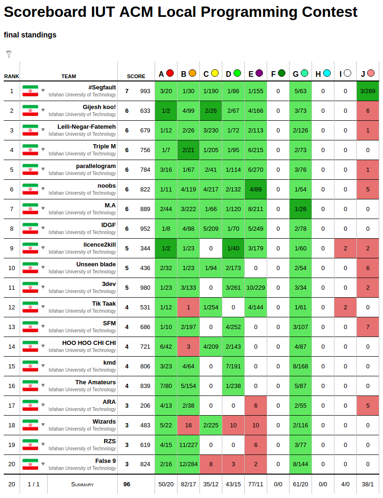
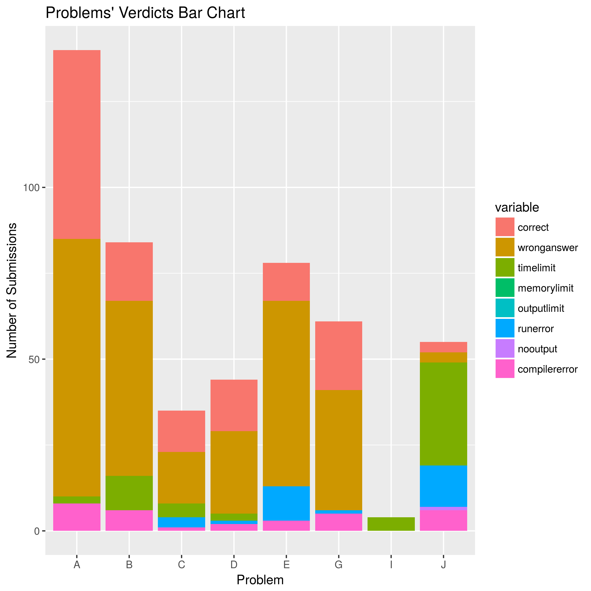
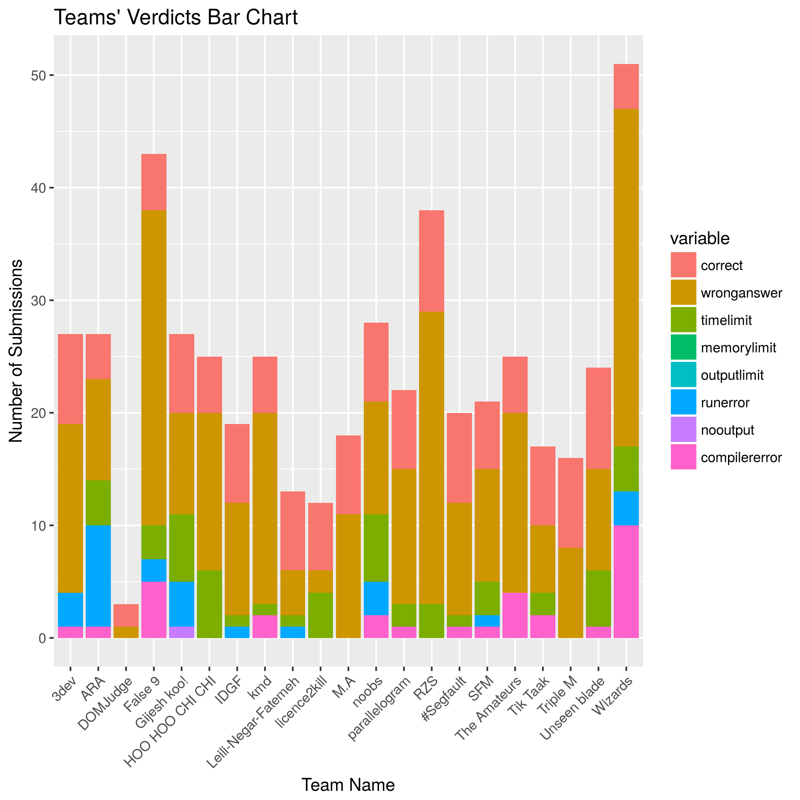
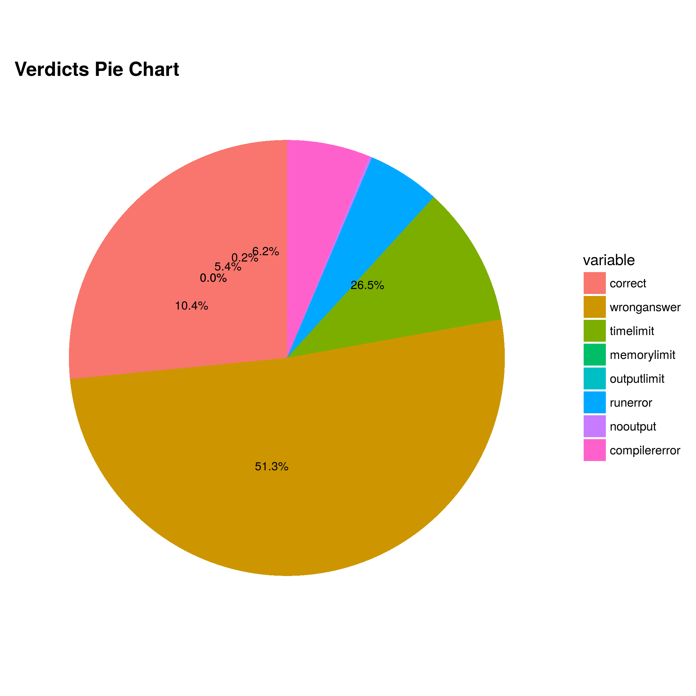

# 46th IUT ACM Local Programming Contest
2017 Feb 16 (1395 Bahman 28)

Electronics and Computer Engineering Dept. - IUT

* [Problems Set PDF](problemset.pdf)

* [Test Cases](test-cases): (TODO)

* [Solutions](solutions): (TODO)

## Final Scoreboard

## Plots

### Problems - Verdicts Bar Plot

### Teams - Verdicts Bar Plot

### Verdicts Pie Plot

