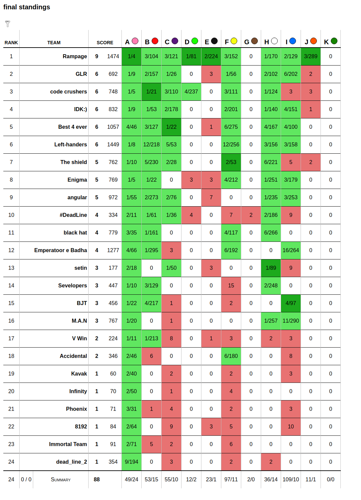

# 47th IUT ACM Local Programming Contest
2018 March 9 (1396 Esfand 18)

Electronics and Computer Engineering Dept. - IUT

* [Problems Set PDF](problemset.pdf)

* [Test Cases](test-cases)

* [Solutions](solutions): (TODO)

## Final Scoreboard

## Plots

### Problems - Verdicts Bar Plot
(TODO)
<!--  -->

### Teams - Verdicts Bar Plot
(TODO)
<!--  -->

### Verdicts Pie Plot
(TODO)
<!--  -->
